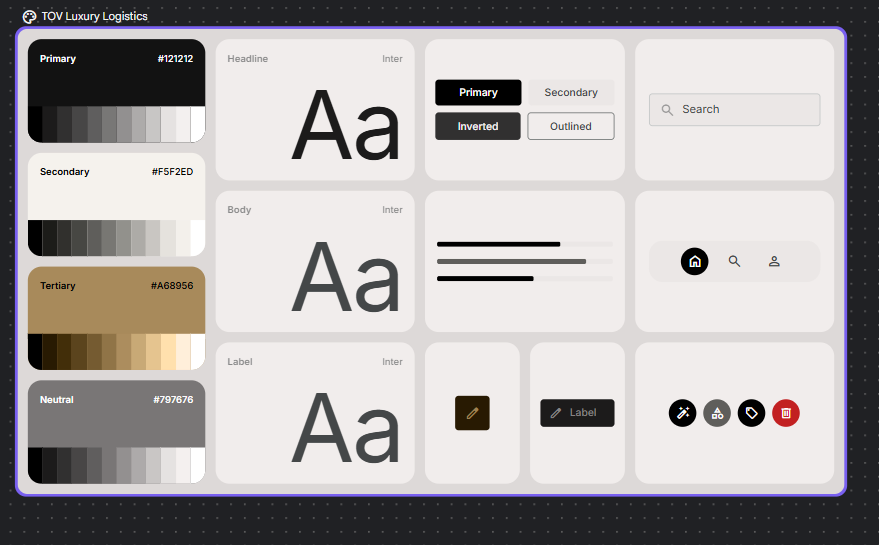
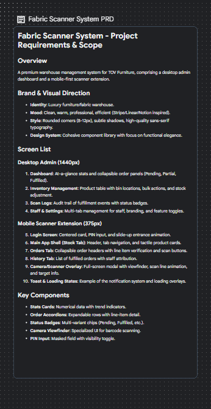
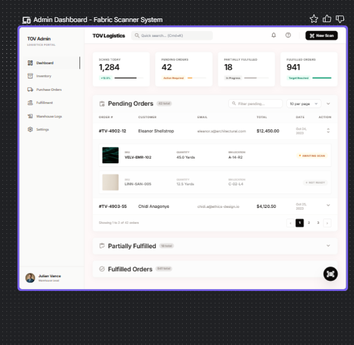
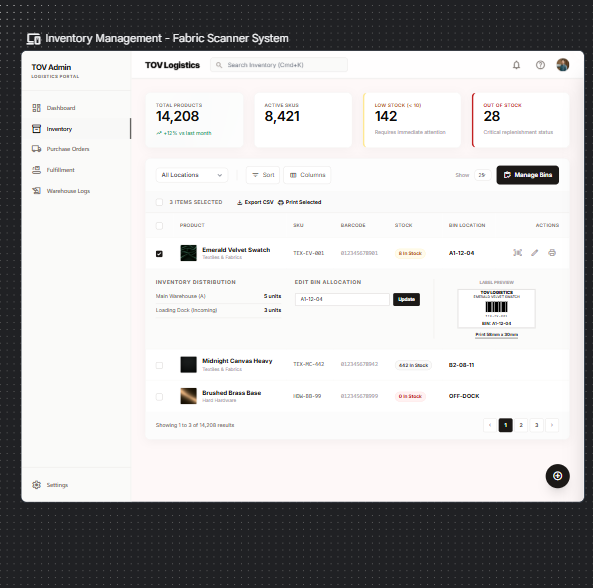
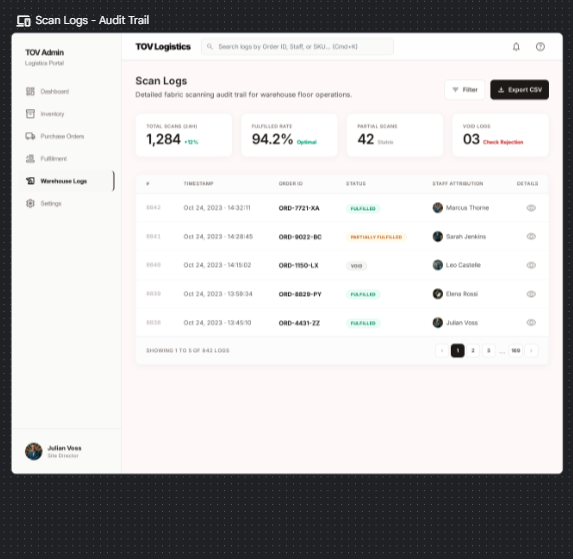
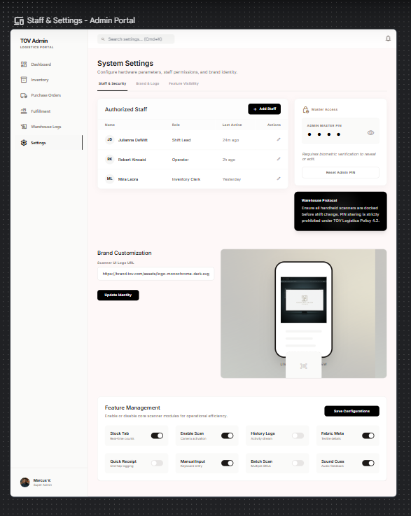
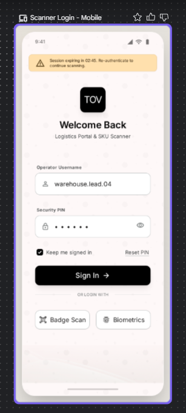
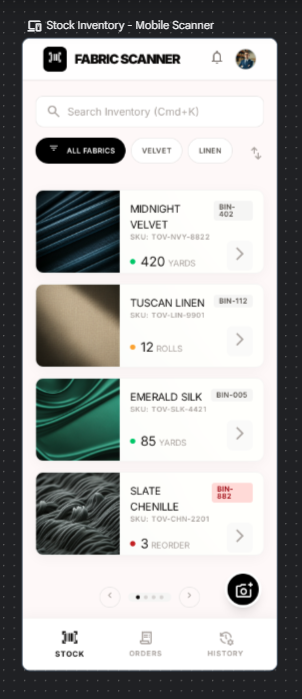
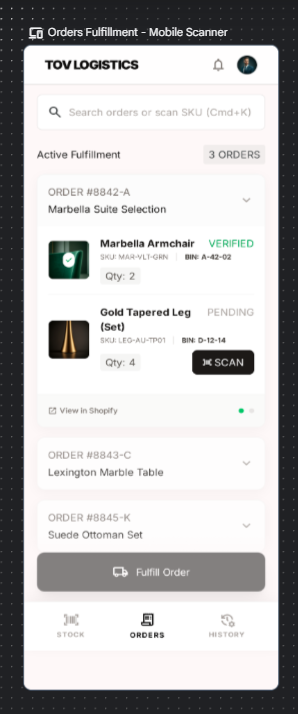
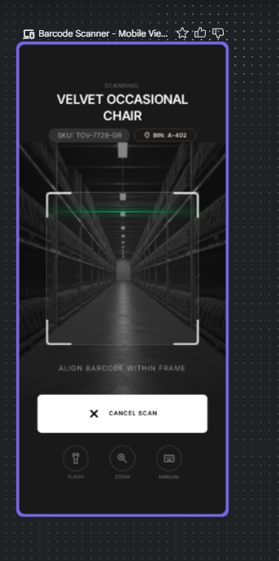

# TOV Luxury Logistics — UI/UX Redesign Reference Guide

> **Purpose:** This document is the single source of truth for the UI overhaul of the Fabric Scanner System. It maps every Stitch design screen to the existing app feature it corresponds to. **No new features are being added** — this is a visual redesign only.

---

## Design System Screenshot



---

## Brand & Design System

### Colors

| Token | Hex | Usage |
|-------|-----|-------|
| Primary | `#121212` | Headings, primary buttons, dark UI elements |
| Secondary / Background | `#F5F2ED` | Page backgrounds, card surfaces (warm cream) |
| Tertiary / Accent | `#A68956` | Gold highlights, active states, premium accents |
| Neutral | `#797676` | Subdued text, secondary labels |
| White Surface | `#FAF7F3` | Card backgrounds, input fields |
| Border | `#D8BFA4` | Card borders, dividers |
| Success | `#A9CEB2` | Fulfilled badges, positive indicators |
| Warning/Orange | `#E8A87C` | Pending states, action required |
| Critical/Red | `#D94F4F` | Out of stock, void, errors |

### Typography

| Level | Font | Weight | Usage |
|-------|------|--------|-------|
| Headline | Inter | 700-800 | Page titles, stat numbers |
| Body | Inter | 400-500 | Paragraphs, table content |
| Label | Inter | 600 | Badges, small caps, metadata |
| Mono | Inter / System Mono | 500 | SKUs, order numbers, PINs |

### Component Style

- **Border Radius:** 8-12px (rounded corners throughout)
- **Shadows:** Subtle (`0 4px 12px rgba(0,0,0,0.03)`) for cards
- **Spacing:** Consistent 16px/20px padding in cards
- **Buttons:** Primary = `#121212` fill with white text, rounded. Secondary = outlined/ghost
- **Badges:** Pill-shaped with colored backgrounds (success green, warning orange, critical red)
- **Navigation:** Left sidebar on desktop, bottom tab bar on mobile

---

## Project Requirements Document (PRD)



---

## Screen Mapping: Design → Existing Code

### Desktop Admin (1440px)

| # | Design Screen | Existing Route | File |
|---|--------------|----------------|------|
| 1 | Dashboard | `/app/home` | `app/routes/app.home.jsx` |
| 2 | Inventory Management | `/app/fabric` | `app/routes/app.fabric.jsx` |
| 3 | Scan Logs (Audit Trail) | `/app/logs` | `app/routes/app.logs.jsx` |
| 4 | Staff & Settings | `/app/settings` | `app/routes/app.settings.jsx` |

### Mobile Scanner Extension (375px)

| # | Design Screen | Existing Feature | File |
|---|--------------|-----------------|------|
| 5 | Login Screen | PIN login | `extensions/scanner-extension/blocks/scanner.liquid` |
| 6 | Stock Tab | Inventory cards | `extensions/scanner-extension/blocks/scanner.liquid` |
| 7 | Orders Tab | Order fulfillment | `extensions/scanner-extension/blocks/scanner.liquid` |
| 8 | Camera/Scanner Overlay | Barcode scanning | `extensions/scanner-extension/blocks/scanner.liquid` |

---

## Screen 1: Dashboard (`app.home.jsx`)

**Design Reference:** Admin Dashboard - Fabric Scanner System



### Layout Structure

```
┌─────────────────────────────────────────────────────────────────┐
│ HEADER: "TOV Logistics" + Search bar (Cmd+K) + Bell + ? + Avatar│
├────────┬────────────────────────────────────────────────────────┤
│        │  ┌──────┐ ┌──────┐ ┌──────┐ ┌──────┐                  │
│ SIDE   │  │Scans │ │Pend. │ │Partial│ │Fulfil│  ← Stats Cards  │
│ NAV    │  │Today │ │Orders│ │Fulfil │ │Orders│                  │
│        │  │1,284 │ │ 42   │ │  18   │ │ 941  │                  │
│ • Dash │  └──────┘ └──────┘ └──────┘ └──────┘                  │
│ • Inv  │                                                        │
│ • PO   │  ┌─────────────────────────────────────────────┐       │
│ • Fulf │  │ Pending Orders (42 total)                   │       │
│ • Logs │  │ Search... | 10 per page                     │       │
│ • Sett │  │ ─────────────────────────────────────────── │       │
│        │  │ ORDER# | CUSTOMER | EMAIL | TOTAL | DATE    │       │
│        │  │ #TV-4902-12 | Eleanor | ... | $12,450 | ... │       │
│        │  │   └─ Line items with SKU, QTY, BIN, STATUS  │       │
│        │  │ #TV-4903-55 | Chidi | ... | $4,120 | ...    │       │
│        │  │ Pagination: < 1 2 3 >                       │       │
│        │  └─────────────────────────────────────────────┘       │
│        │                                                        │
│        │  ┌─ Partially Fulfilled (18 total) ─────── ▼ ┐         │
│        │  └───────────────────────────────────────────┘         │
│ User   │  ┌─ Fulfilled Orders (941 total) ──────── ▼ ┐         │
│ Avatar │  └───────────────────────────────────────────┘         │
└────────┴────────────────────────────────────────────────────────┘
```

### Stats Cards (Top Row)
- **Scans Today:** Large number + `+12.3%` trend indicator (green bar)
- **Pending Orders:** Count + "Action Required" label (orange bar)
- **Partially Fulfilled:** Count + "In Progress" label (neutral bar)
- **Fulfilled Orders:** Count + "Target Reached" label (green bar)

### Existing Features to Restyle (NOT add)
- ✅ Stats cards (already exist: `scansToday`, `totalPending`, `totalPartial`, `totalFulfilled`)
- ✅ Pending Orders collapsible section with search + pagination
- ✅ Partially Fulfilled collapsible section with search + pagination
- ✅ Fulfilled History collapsible section with search + pagination
- ✅ Order rows expand to show line items (SKU, quantity, bin location, scan status)
- ✅ Page size selector (5/10/25/50 per page)

### Visual Changes Needed
- Add left sidebar navigation (currently using Shopify Polaris `Page` layout)
- Add top header bar with "TOV Logistics" branding + quick search
- Restyle stats cards with colored progress bars underneath numbers
- Restyle order table with cleaner typography and spacing
- Add status badges: "AWAITING SCAN" (red), "NOT READY" (gray) per line item
- Collapsible sections with chevron icons and count badges

---

## Screen 2: Inventory Management (`app.fabric.jsx`)

**Design Reference:** Inventory Management - Fabric Scanner System



### Layout Structure

```
┌─────────────────────────────────────────────────────────────────┐
│ HEADER: "TOV Logistics" + Search Inventory (Cmd+K) + Bell + Avatar│
├────────┬────────────────────────────────────────────────────────┤
│        │  ┌──────┐ ┌──────┐ ┌──────┐ ┌──────┐                  │
│ SIDE   │  │Total │ │Active│ │Low   │ │Out of│  ← Stats Cards   │
│ NAV    │  │Prods │ │SKUs  │ │Stock │ │Stock │                  │
│        │  │14,208│ │8,421 │ │ 142  │ │  28  │                  │
│ • Dash │  └──────┘ └──────┘ └──────┘ └──────┘                  │
│ •*Inv* │                                                        │
│ • PO   │  [All Locations ▼] [Sort] [Columns] Show:25 [Manage Bins]│
│ • Fulf │                                                        │
│ • Logs │  ☐ 3 ITEMS SELECTED | Export CSV | Print Selected      │
│ • Sett │  ─────────────────────────────────────────────────────  │
│        │  ☑ │ IMG │ PRODUCT        │ SKU      │ BARCODE │ STOCK │ BIN     │ ACTIONS │
│        │  ☑ │ 🟢 │ Emerald Velvet │ TEX-EV-001│ 012345 │ 8 ✓  │ A1-12-04│ ✏️ 🖨️  │
│        │  │     └─ INVENTORY DISTRIBUTION    │ EDIT BIN        │ LABEL PREVIEW │
│        │  │        Main Warehouse: 5 units   │ [A1-12-04] [Upd]│ [Barcode img] │
│        │  │        Loading Dock: 3 units     │                 │ Print 38mm    │
│        │  ☐ │ ⬛ │ Midnight Canvas│ TEX-MC-M2│ 012345 │ 642  │ B2-08-11│         │
│        │  ☐ │ 🟤 │ Brushed Brass  │ HDW-BB-99│ 012345 │ 0 ✗  │ OFF-DOCK│         │
│        │  ─────────────────────────────────────────────────────  │
│        │  Showing 1 to 3 of 14,208 results  │ < 1 2 3 >        │
└────────┴────────────────────────────────────────────────────────┘
```

### Existing Features to Restyle (NOT add)
- ✅ Global inventory stats (total products, low stock, out of stock)
- ✅ Product table with image, title, SKU, barcode, stock level, bin location
- ✅ Expandable row showing inventory distribution across locations
- ✅ Inline bin location editor with Update button
- ✅ Barcode/label preview with print button
- ✅ Location filter dropdown
- ✅ Sort options
- ✅ Pagination with page size selector
- ✅ "Manage Bins" modal (import/export bin locations)
- ✅ Bulk export barcodes action
- ✅ Stock level badges (green = in stock, red = out of stock)

### Visual Changes Needed
- Add "Active SKUs" stat card (currently only shows total, low stock, out of stock)
- Restyle table to match design (cleaner rows, better spacing)
- Add checkbox selection column for bulk actions
- Show "3 ITEMS SELECTED | Export CSV | Print Selected" toolbar when items selected
- Restyle expanded row with 3-column layout: Distribution | Edit Bin | Label Preview
- Add colored border on stats cards (green for total, yellow for low, red for out of stock)

---

## Screen 3: Scan Logs (`app.logs.jsx`)

**Design Reference:** Scan Logs - Audit Trail



### Layout Structure

```
┌─────────────────────────────────────────────────────────────────┐
│ HEADER: "TOV Logistics" + Search logs (Cmd+K) + Bell + ?       │
├────────┬────────────────────────────────────────────────────────┤
│        │  Scan Logs                                             │
│ SIDE   │  Detailed fabric scanning audit trail for warehouse    │
│ NAV    │  floor operations.                                     │
│        │                                                        │
│ • Dash │  ┌──────┐ ┌──────┐ ┌──────┐ ┌──────┐                  │
│ • Inv  │  │Total │ │Fulfil│ │Partial│ │Void  │  ← Stats Cards  │
│ • PO   │  │Scans │ │Rate  │ │Scans │ │Logs  │                  │
│ • Fulf │  │1,284 │ │94.2% │ │  42  │ │  03  │                  │
│ •*Logs*│  └──────┘ └──────┘ └──────┘ └──────┘                  │
│ • Sett │                                                        │
│        │  [Filter] [Export CSV]                                  │
│        │  ─────────────────────────────────────────────────────  │
│        │  # │ TIMESTAMP           │ ORDER ID    │ STATUS    │ STAFF        │ 👁️ │
│        │  0042│ Oct 24, 14:32:11  │ ORD-7721-XA │ FULFILLED │ Marcus Thorne│ 👁️ │
│        │  0041│ Oct 24, 14:28:45  │ ORD-9022-BC │ PARTIAL   │ Sarah Jenkins│ 👁️ │
│        │  0040│ Oct 24, 14:15:02  │ ORD-1150-LX │ VOID      │ Leo Castele  │ 👁️ │
│        │  ─────────────────────────────────────────────────────  │
│        │  SHOWING 1 TO 5 OF 842 LOGS  │ < 1 2 3 ... 160 >      │
│ User   │                                                        │
│ Avatar │                                                        │
└────────┴────────────────────────────────────────────────────────┘
```

### Existing Features to Restyle (NOT add)
- ✅ Log table with timestamp, order ID, status badge, staff name, details
- ✅ Search by Order ID, Staff Name, or Email
- ✅ Pagination
- ✅ Status badges (FULFILLED = green, PARTIALLY FULFILLED = orange, VOID = red)
- ✅ Staff attribution with name

### Visual Changes Needed
- Add stats cards row at top (Total Scans, Fulfilled Rate %, Partial Scans, Void Logs)
- Add page subtitle: "Detailed fabric scanning audit trail for warehouse floor operations"
- Add "Filter" button and "Export CSV" button in toolbar
- Add staff avatar circles next to names
- Add eye icon for "Details" column (view log detail)
- Restyle status badges with colored pill backgrounds
- Better pagination showing total count and page numbers

---

## Screen 4: Staff & Settings (`app.settings.jsx`)

**Design Reference:** Staff & Settings - Admin Portal



### Layout Structure

```
┌─────────────────────────────────────────────────────────────────┐
│ HEADER: Search settings... (Cmd+K) + Bell                       │
├────────┬────────────────────────────────────────────────────────┤
│        │  System Settings                                       │
│ SIDE   │  Configure hardware parameters, staff permissions,     │
│ NAV    │  and brand identity.                                   │
│        │                                                        │
│ • Dash │  [Staff & Security] [Brand & Logo] [Feature Visibility]│
│ • Inv  │                                                        │
│ • PO   │  ┌─ Authorized Staff ──────────────┐ ┌─ Master Access ─┐│
│ • Fulf │  │ [+ Add Staff]                   │ │ ADMIN MASTER PIN│ │
│ • Logs │  │ Name    │ Role    │ Last Active  │ │ • • • • •       │ │
│ •*Sett*│  │ Julianna│ Shift Ld│ 24m ago    ✏️│ │ [Reset Admin PIN]│ │
│        │  │ Robert  │ Operator│ 2h ago     ✏️│ └─────────────────┘│
│        │  │ Mira    │ Inv Clrk│ Yesterday  ✏️│                    │
│        │  └─────────────────────────────────┘                    │
│        │                                                        │
│        │  ┌─ Warehouse Protocol ─────────────────────────────┐  │
│        │  │ Ensure all handheld scanners are docked before   │  │
│        │  │ shift change. PIN sharing is strictly prohibited. │  │
│        │  └──────────────────────────────────────────────────┘  │
│        │                                                        │
│        │  Brand Customization                                   │
│        │  Scanner UI Logo URL: [https://brand.tov.com/...]      │
│        │  [Update Identity]                                     │
│        │                                                        │
│        │  Feature Management                    [Save Config]   │
│        │  ┌─────────────────────────────────────────────────┐   │
│        │  │ Stock Tab 🔵 │ Enable Scan 🔵 │ History 🔴 │ Fabric 🔵│
│        │  │ Quick Rcpt🔴 │ Manual Input🔵 │ Batch  🔴 │ Sound 🔵│
│        │  └─────────────────────────────────────────────────┘   │
└────────┴────────────────────────────────────────────────────────┘
```

### Existing Features to Restyle (NOT add)
- ✅ Tabs: Staff & Security | Brand & Logo | Feature Visibility
- ✅ Staff table with Name, Email, PIN, Edit/Delete actions
- ✅ Add Staff modal (name, email, PIN)
- ✅ Global Admin Credentials (admin name + PIN with show/hide toggle)
- ✅ Brand Logo upload with preview
- ✅ Feature toggles (Stock Tab, Orders Tab, History Tab, Scan Button, etc.)

### Visual Changes Needed
- Restyle tabs to horizontal pill-style buttons
- Split Staff & Security into two-column layout: Staff list (left) + Master PIN card (right)
- Add "Role" and "Last Active" columns to staff table (currently only Name, Email, PIN)
- Add toggle switches instead of checkboxes for Feature Management
- Grid layout for feature toggles (4 columns × 2 rows)
- Add "Warehouse Protocol" info card (dark background, warning text)
- Restyle brand section with side-by-side logo preview + phone mockup

---

## Screen 5: Mobile Login (`scanner.liquid`)

**Design Reference:** Scanner Login - Mobile



### Layout Structure

```
┌─────────────────────────┐
│ ⚠️ Session expiring in  │  ← Warning banner (only when session expires)
│    02:45. Re-auth...    │
├─────────────────────────┤
│                         │
│       ┌─────┐           │
│       │ TOV │           │  ← Brand logo (from settings)
│       └─────┘           │
│                         │
│    Welcome Back          │
│    Logistics Portal &    │
│    SKU Scanner           │
│                         │
│  ┌─────────────────────┐│
│  │ 👤 warehouse.lead.04││  ← Operator Username field
│  └─────────────────────┘│
│                         │
│  ┌─────────────────────┐│
│  │ 🔒 • • • • • •    👁️││  ← Security PIN field (masked)
│  └─────────────────────┘│
│                         │
│  ☑ Keep me signed in    │  Reset PIN link
│                         │
│  ┌─────────────────────┐│
│  │   Sign In →          ││  ← Primary CTA (black, full-width)
│  └─────────────────────┘│
│                         │
│     OR LOGIN WITH        │
│  [Badge Scan] [Biometrics]│  ← Alternative login methods
│                         │
└─────────────────────────┘
```

### Existing Features to Restyle (NOT add)
- ✅ PIN-based login (username/name + PIN)
- ✅ Brand logo display
- ✅ Login form with validation
- ✅ Show/hide PIN toggle

### Visual Changes Needed
- Center the login card vertically with slide-up entrance animation
- Add "Welcome Back" heading with subtitle "Logistics Portal & SKU Scanner"
- Restyle input fields with left icons (person icon, lock icon)
- Add "Keep me signed in" checkbox + "Reset PIN" link
- Full-width black "Sign In →" button
- Add "OR LOGIN WITH" divider with Badge Scan / Biometrics buttons (UI only — these are not functional features, just visual placeholders from Stitch to IGNORE)
- Add session expiry warning banner at top (only if session management exists)

### ⚠️ IGNORE from Stitch (not existing features)
- Badge Scan login method
- Biometrics login method
- Session expiry countdown timer

---

## Screen 6: Mobile Stock Tab (`scanner.liquid`)

**Design Reference:** Stock Inventory - Mobile Scanner



### Layout Structure

```
┌─────────────────────────┐
│ 📊 FABRIC SCANNER  🔔 👤│  ← Header with logo + notifications + avatar
├─────────────────────────┤
│ 🔍 Search Inventory     │  ← Search bar (Cmd+K)
├─────────────────────────┤
│ [ALL FABRICS] [VELVET]   │  ← Filter chips (by product type)
│ [LINEN] ↕️               │  ← Sort toggle
├─────────────────────────┤
│ ┌───────────────────────┐│
│ │ 🖼️ MIDNIGHT VELVET    ││  ← Product card
│ │    SKU: TOV-NVY-8822  ││
│ │    • 420 YARDS    BIN-││
│ │                   402 ││
│ │                    >  ││
│ └───────────────────────┘│
│ ┌───────────────────────┐│
│ │ 🖼️ TUSCAN LINEN      ││
│ │    SKU: TOV-LIN-9901  ││
│ │    • 12 ROLLS    BIN- ││
│ │                   112 ││
│ └───────────────────────┘│
│ ┌───────────────────────┐│
│ │ 🖼️ EMERALD SILK      ││
│ │    SKU: TOV-SLK-4421  ││
│ │    • 85 YARDS    BIN- ││
│ │                   095 ││
│ └───────────────────────┘│
│ ┌───────────────────────┐│
│ │ 🖼️ SLATE CHENILLE    ││
│ │    SKU: TOV-CHN-2201  ││
│ │    • 3 REORDER   BIN- ││  ← Red dot = low stock
│ │                   882 ││
│ └───────────────────────┘│
│                         │
│ < • • • • >             │  ← Pagination dots
│         📷              │  ← Camera FAB button
├─────────────────────────┤
│ 📊STOCK  📋ORDERS  🕐HISTORY│ ← Bottom tab bar
└─────────────────────────┘
```

### Existing Features to Restyle (NOT add)
- ✅ Product/stock cards with image, title, SKU, quantity, bin location
- ✅ Search functionality
- ✅ Sort toggle
- ✅ Tab navigation (Stock / Orders / History)
- ✅ Camera/scan button (FAB)

### Visual Changes Needed
- Add filter chips row (All Fabrics, Velvet, Linen, etc.) — filter by product type
- Restyle stock cards: larger images, bolder typography, BIN badge on right
- Add stock level color indicators (green dot = good, orange dot = low, red dot = reorder)
- Add pagination dots instead of numbered pagination
- Restyle bottom tab bar with icons + labels
- Add notification bell in header
- Camera FAB button (floating action button) in bottom-right

---

## Screen 7: Mobile Orders Tab (`scanner.liquid`)

**Design Reference:** Orders Fulfillment - Mobile



### Layout Structure

```
┌─────────────────────────┐
│ TOV LOGISTICS      🔔 👤│  ← Header
├─────────────────────────┤
│ 🔍 Search orders or     │
│    scan SKU (Cmd+K)      │
├─────────────────────────┤
│ Active Fulfillment       │  3 ORDERS
├─────────────────────────┤
│ ORDER #8842-A         ▼  │  ← Collapsible order
│ Marbella Suite Selection │
│ ┌───────────────────────┐│
│ │ 🖼️ Marbella Armchair  ││
│ │    SKU: MAR-VLT-GRN   ││
│ │    BIN: A-42-02       ││
│ │    Qty: 2    VERIFIED ✓││  ← Green "VERIFIED" badge
│ └───────────────────────┘│
│ ┌───────────────────────┐│
│ │ 🖼️ Gold Tapered Leg   ││
│ │    SKU: LEG-AU-TP01   ││
│ │    BIN: D-12-14       ││
│ │    Qty: 4    [✕ SCAN] ││  ← "SCAN" button for pending items
│ └───────────────────────┘│
│ 🔗 View in Shopify    🟢 │
├─────────────────────────┤
│ ORDER #8843-C         ▼  │
│ Lexington Marble Table   │
├─────────────────────────┤
│ ORDER #8845-K         ▼  │
│ Suede Ottoman Set        │
├─────────────────────────┤
│                         │
│ ┌───────────────────────┐│
│ │   📦 Fulfill Order    ││  ← Full-width CTA (gray when not all verified)
│ └───────────────────────┘│
├─────────────────────────┤
│ 📊STOCK  📋ORDERS  🕐HISTORY│
└─────────────────────────┘
```

### Existing Features to Restyle (NOT add)
- ✅ Order accordion/collapsible cards
- ✅ Line items with image, title, SKU, bin location, quantity
- ✅ Scan button per line item
- ✅ Status indicators (verified/pending per item)
- ✅ "View in Shopify" link
- ✅ Fulfill Order button
- ✅ Tab navigation

### Visual Changes Needed
- Restyle order headers with order name + product collection name
- Add "VERIFIED" green badge and "PENDING" gray badge per line item
- Restyle SCAN button as dark pill button with ✕ icon
- Add "Active Fulfillment" section header with order count
- Full-width "Fulfill Order" CTA at bottom (disabled/gray until all items verified)
- Cleaner card spacing and typography

---

## Screen 8: Camera/Scanner Overlay (`scanner.liquid`)

**Design Reference:** Barcode Scanner - Mobile Viewfinder



### Layout Structure

```
┌─────────────────────────┐
│                         │
│  SCANNING:              │  ← Product name being scanned
│  VELVET OCCASIONAL      │
│  CHAIR                  │
│                         │
│  [SKU: TOV-7729-GR]    │  ← SKU badge (dark pill)
│  [📍 BIN: A-402]       │  ← BIN badge (dark pill)
│                         │
│  ┌───────────────────┐  │
│  │                   │  │
│  │   ┌───────────┐   │  │  ← Viewfinder frame (white corners)
│  │   │           │   │  │
│  │   │  ═══════  │   │  │  ← Green scan line (animated)
│  │   │           │   │  │
│  │   └───────────┘   │  │
│  │                   │  │
│  └───────────────────┘  │
│                         │
│  ALIGN BARCODE WITHIN   │  ← Instruction text
│  FRAME                  │
│                         │
│  ┌───────────────────┐  │
│  │   ✕ CANCEL SCAN   │  │  ← Cancel button (white, outlined)
│  └───────────────────┘  │
│                         │
│  🔦FLASH  🔍ZOOM  ⌨️MANUAL│ ← Camera controls
│                         │
└─────────────────────────┘
```

### Existing Features to Restyle (NOT add)
- ✅ Camera viewfinder with barcode scanning
- ✅ Product info overlay (name, SKU shown after scan)
- ✅ Cancel scan button
- ✅ Manual input option (fallback for camera issues)

### Visual Changes Needed
- Full-screen dark overlay with camera feed
- White corner brackets for viewfinder frame
- Animated green scan line moving vertically
- Product name + SKU + BIN displayed above viewfinder
- "ALIGN BARCODE WITHIN FRAME" instruction below viewfinder
- Bottom toolbar: Flash toggle, Zoom, Manual input
- Restyle cancel button as white outlined pill

---

## Sidebar Navigation (Desktop — All Pages)

### Structure
```
TOV Admin
LOGISTICS PORTAL

• Dashboard        (grid icon)
• Inventory        (box icon)
• Purchase Orders  (clipboard icon)
• Fulfillment      (truck icon)
• Warehouse Logs   (document icon)
• Settings         (gear icon)

─────────────────
User Avatar + Name
Role title
```

### Notes
- The sidebar shows "Purchase Orders" and "Fulfillment" as nav items in the Stitch design
- **These do NOT exist as separate routes in the current app** — they are part of the Dashboard (pending/fulfilled sections)
- For the redesign: either keep them as visual nav items that scroll to the relevant dashboard section, OR simply omit them and keep the existing 4-page structure (Dashboard, Inventory, Logs, Settings)
- **Recommendation:** Keep existing 4-page structure. Do NOT create new routes.

---

## Implementation Priority Order

1. **Design System Setup** — CSS variables, font imports, shared component styles
2. **Sidebar + Header Layout** — Shared layout wrapper for all desktop pages
3. **Dashboard Restyle** — Stats cards, order tables, collapsible sections
4. **Inventory Restyle** — Table, expanded rows, stats cards
5. **Logs Restyle** — Stats row, table, badges
6. **Settings Restyle** — Tabs, toggles, two-column layout
7. **Mobile Login** — Centered card, animations, input styling
8. **Mobile Stock Tab** — Cards, filter chips, FAB button
9. **Mobile Orders Tab** — Accordions, badges, fulfill CTA
10. **Mobile Scanner Overlay** — Viewfinder, animations, controls

---

## Key Constraints

- **No new routes or pages** — only restyle existing ones
- **No new backend features** — all data already exists in loaders/actions
- **No new database models** — use existing Prisma schema
- **Preserve all existing functionality** — search, pagination, CRUD operations
- **Mobile scanner is a Liquid theme extension** — CSS/JS only, no React
- **Desktop admin uses Shopify Polaris** — can use custom CSS alongside Polaris components
- **Keep Polaris components where possible** — override styles rather than replacing entirely

---

## Files That Will Be Modified

### Desktop Admin (Remix)
| File | Changes |
|------|---------|
| `app/routes/app.jsx` | Add sidebar + header layout wrapper |
| `app/routes/app.home.jsx` | Restyle dashboard UI |
| `app/routes/app.fabric.jsx` | Restyle inventory table UI |
| `app/routes/app.logs.jsx` | Restyle logs table + add stats |
| `app/routes/app.settings.jsx` | Restyle settings tabs + toggles |
| `app/root.jsx` | Add Inter font import, global CSS variables |

### Mobile Scanner Extension (Liquid/CSS/JS)
| File | Changes |
|------|---------|
| `extensions/scanner-extension/blocks/scanner.liquid` | Restyle all mobile views |
| `extensions/scanner-extension/assets/print-label.js` | No changes needed |

---

## What to IGNORE from Stitch Designs

These elements appear in the Stitch mockups but are NOT features in the current app and should NOT be implemented:

- ❌ Badge Scan login method (Screen 5)
- ❌ Biometrics login method (Screen 5)
- ❌ Session expiry countdown timer (Screen 5)
- ❌ "Purchase Orders" as a separate page/route
- ❌ "Fulfillment" as a separate page/route
- ❌ Notification bell functionality (can add icon but no backend)
- ❌ Quick search (Cmd+K) global command palette
- ❌ User avatar with role display in sidebar (no user profile system exists)
- ❌ "Last Active" column in staff table (not tracked)
- ❌ "Role" column in staff table (not in current schema)
- ❌ Flash/Zoom camera controls (hardware-dependent, not currently implemented)
- ❌ Pagination dots on mobile (current pagination works differently)
- ❌ "View in Shopify" green dot indicator
